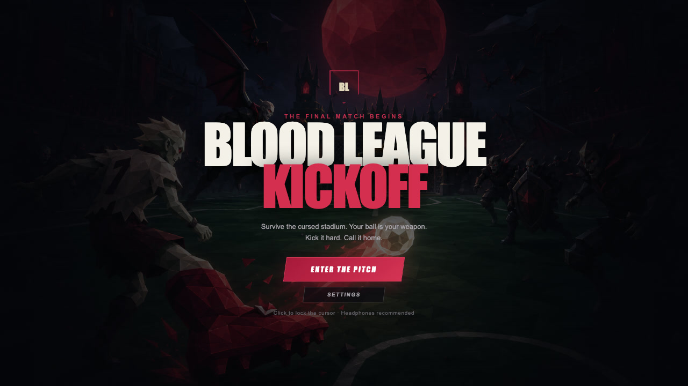
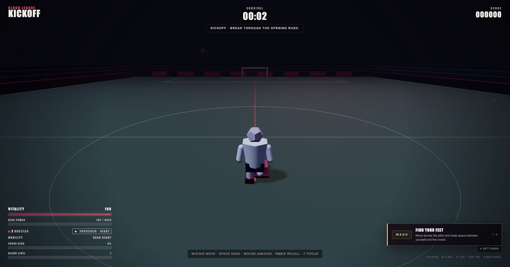
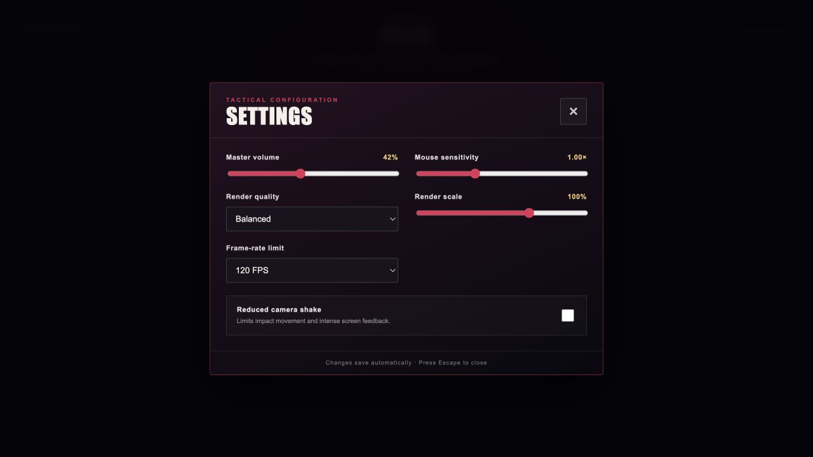

# Blood League: Kickoff

> A third-person football-combat horde-survival roguelite created for the IUT 12th ICT Fest 2026 GameJam.

| Project   | Value                                                                |
| --------- | -------------------------------------------------------------------- |
| Status    | Complete nine-minute run alpha in active development                 |
| Theme     | Kickoff                                                              |
| Platforms | Web and macOS development first; Windows desktop at final submission |
| Stack     | Three.js, TypeScript, Vite, Rapier, Electron                         |
| Input     | Keyboard and mouse                                                   |



## The Game

The opening kickoff of a cursed football match awakens a stadium full of vampires. The last human striker must survive the match using an enchanted football, supernatural boots, and spectral teammates.

The ball is the player's main weapon, defensive tool, positional risk, and key to advancing the match. Kick, curve, rebound, recall, and volley it through the horde. Every goal begins another kickoff, mutates the enemy crowd, and pushes the player toward a final confrontation with Count Goalkeeper.

### Current gameplay



### Settings



## Design Pillars

1. **The ball is the combat system.** Its movement and impact must feel excellent before more content is added.
2. **Every kickoff changes the match.** Goals advance phases, introduce enemy mutations, and transform the stadium.
3. **Readable spectacle.** Large crowds and strong impacts must remain easy to understand.
4. **Short, replayable runs.** A complete run targets 8–10 minutes.
5. **Performance is a feature.** The game targets stable 60 FPS and supports 120 Hz displays on capable hardware.

## Core Loop

1. Move through the stadium and control space.
2. Kick the ball through vampire crowds.
3. Recall, redirect, or perfectly volley the returning ball.
4. Collect blood shards and choose one of three upgrades.
5. Score when the enemy goal opens.
6. Survive the more dangerous kickoff phase.
7. Defeat Count Goalkeeper or fall and begin a new run.

## Controls

| Action                | Input                                                                          | Status                                                |
| --------------------- | ------------------------------------------------------------------------------ | ----------------------------------------------------- |
| Move                  | `WASD`                                                                         | Implemented                                           |
| Aim / camera          | Mouse                                                                          | Implemented after entering the pitch/pointer lock     |
| Kick / charge / curve | Hold and release left mouse button; move mouse sideways while charging to bend | Implemented                                           |
| Recall ball           | Right mouse button or `E`                                                      | Implemented                                           |
| Restart after kickoff | `R`                                                                            | Implemented                                           |
| Dash                  | `Space`                                                                        | Implemented with cooldown and brief invulnerability   |
| Focus Kick ultimate   | `F`                                                                            | Implemented with first-person slow-time aiming        |
| Pause                 | `Esc`                                                                          | Implemented; also activates when the game loses focus |
| Settings              | Title-screen or in-game `⚙ SETTINGS` button                                    | Implemented and persistent                            |

Controls and bindings may change during playtesting.

## Submission Scope

### Guaranteed build

- One playable striker and one gothic stadium
- One complete 8–10 minute run
- Kick, rebound, recall, curve, and perfect-volley mechanics
- Eight normal enemy behaviors plus a final boss or fallback final elite wave
- Ten upgrades and two evolved combinations
- Menus, settings, tutorial prompts, win, loss, pause, and restart
- Playable web build and tested portable Windows `.exe`

### Target build

- Eight enemy behaviors with visual variants
- Twelve or more weapons/upgrades and five evolutions
- Three match phases and a halftime choice
- Brief first-person Focus Kick ultimate
- Performance, balanced, and quality presets
- Expanded VFX, audio layers, accessibility, and presentation

Target features remain gated until the guaranteed vertical slice is fun, stable, and performant.

## Technology

- **Three.js / WebGL 2:** GPU-accelerated 3D rendering
- **TypeScript + Vite:** code-first development and browser builds
- **Rapier:** fixed-step WASM physics for the player, ball, arena, and important collisions
- **HTML/CSS:** menus, HUD, upgrade cards, and settings
- **Web Audio:** music, effects, and phase transitions
- **Electron:** self-contained GPU-accelerated desktop build for local macOS testing and final Windows delivery
- **electron-builder:** portable `.exe` packaging
- **GitHub Actions:** manual-only final Windows packaging

The game uses no AI service at runtime. Browser and desktop releases share the same gameplay code.

## Development

### Current progress — July 14, 2026

- [x] Game concept, theme interpretation, scope gates, and architecture selected
- [x] Git repository initialized from the jam's empty starting point
- [x] GitHub remote configured at `Seyamalam/blood-league-kickoff`
- [x] Documentation baseline committed
- [x] Three.js/Vite/Rapier source scaffold created
- [x] Fixed-step simulation with interpolated player, enemy, and ball rendering
- [x] Third-person movement, pointer-lock camera, kick, rebound, and manual/automatic recall
- [x] Charged kicks, a capped 36-unit ball speed, recall states, and perfect-return volleys
- [x] Eight enemy archetypes through Bat Swarm, Leech Striker, Corrupt Referee, and Goalkeeper Brute
- [x] Coach speed aura, durable Defender silhouette, and allocation-conscious crowd separation
- [x] Enemy damage/death, scoring/combo, player damage/death, and restart
- [x] Procedural Web Audio for kicks, volleys, recalls, hits, kills, and player damage
- [x] Blood XP levels and a paused three-card upgrade choice flow
- [x] Silver Ball, Power Kick, and Rapid Recall immediately affect live combat
- [x] Pooled physical blood shards burst from kills, magnet to the player, and grant XP on collection
- [x] Piercing Studs, Garlic Trail, Orbiting Spectral Ball, Blood Bomb, and Ghost Pass work in live combat
- [x] Defender shields, rear-shot weakness, deliberate knockback, and telegraphed Winger lunges
- [x] Automated progression, pickup, secondary-weapon, match, and boss tests
- [x] Full nine-minute match director with two goals, halftime tactics, Blood Moon, boss wave, and victory screen
- [x] On-pitch animated goal beacon during scoring opportunities
- [x] Speed-reactive ball trail, pooled hit/volley bursts, and restrained camera impact feedback
- [x] Persistent volume, sensitivity, quality, render scale, frame-rate, and reduced-shake settings
- [x] Count Goalkeeper final encounter with health phases, charges, contact attacks, boss HUD, and victory integration
- [x] Moon Breaker and Crimson Meteor evolutions unlock automatically from their required upgrade pairs
- [x] Full match director covers first goal, escalation, halftime, Blood Moon, final goal, boss wave, and outcomes
- [x] Power, Pace, and Control halftime choices apply distinct second-half combat bonuses
- [x] Goal celebrations reset the live formation and begin a fresh kickoff without erasing run progress
- [x] Stage-reactive fog, lighting, embers, and animated match announcements communicate escalation
- [x] Count Goalkeeper summons readable boosted Winger and Defender elites
- [x] Accessible pause menu and detailed victory/defeat results with run statistics and final loadout
- [x] Focus-loss and hidden-window pause protection
- [x] Six-step first-run tutorial for movement, kick, recall, dash, progression, and scoring
- [x] Restrained mouse-intent kick curve with speed-cap and recall safeguards
- [x] Stadium-boundary camera collision prevents orbit clipping through outer walls
- [x] Live diagnostics report FPS/frame time, draw calls, triangles, fixed steps, enemies, and pooled-object use
- [x] Typed-array spatial grid replaces full-crowd separation and Coach-aura scans
- [x] Procedural match music blends drone, tension, and pulse layers across every phase
- [x] Automated wall, corner, stall, out-of-bounds, recall, catch, reset, and curved-flight recovery coverage
- [x] Planar stall detection and immediate catch-velocity cleanup close two ball recovery edge cases
- [x] Independent persistent master, music, and effects volume controls with safe schema migration
- [x] Persistent Off/Low/High aim assist that gently steers kicks toward nearby on-reticle enemies
- [x] Distinct procedural boss entrance, phase escalation, victory, and defeat cues
- [x] Dedicated procedural evolution cue and version/commit metadata on run results
- [x] First-person Focus Kick ultimate with combat-built meter, slow-time aim, empowered shot, and cooldown
- [x] Storm Studs chain lightning with deterministic bounded hops and cyan impact feedback
- [x] Frost Cleats impact bursts with deterministic victim caps, damage, and timed movement slow
- [x] Color-independent ball-state patterns and animated geometric special-attack markers
- [x] Complete HMR/shutdown disposal for listeners, UI, WebGL, shared render resources, and Rapier
- [x] Secure macOS Electron window-size, fullscreen/windowed, and Quit controls verified in the real app
- [x] Deterministic full nine-minute stage/deadline/goal/halftime/boss outcome coverage and dense-crowd stress tests
- [x] ESLint, Prettier, pinned Node/npm metadata, clean `npm ci`, and push/PR verification workflow
- [x] Real title, gameplay, and settings screenshots stored in the repository and displayed above
- [x] Ball stall/timeout/out-of-bounds recovery fail-safes
- [x] Playable HUD with kickoff/death overlays, health, time, score, enemy count, ball state, and FPS
- [x] Electron shell created and booted on macOS
- [x] Windows workflow retained as a manual-only final-submission task
- [x] Type-check and production web build pass locally
- [x] Browser visual smoke tests pass kickoff, live HUD, spawning, death, and restart flows
- [x] Production Electron shell boots locally on macOS
- [ ] Pointer-lock combat feel accepted through a manual playtest
- [ ] Human balance testing for the complete nine-minute configuration
- [ ] Final Windows portable build after the game is content-complete

### Project documents

- [Production plan](Plan.md)
- [Ordered task list](TODO.md)
- [Game design](docs/GAME_DESIGN.md)
- [Technical architecture](docs/TECHNICAL_ARCHITECTURE.md)
- [Locked visual direction](docs/VISUAL_DIRECTION.md)
- [Release process](docs/RELEASE_PROCESS.md)
- [Asset credits](docs/ASSET_CREDITS.md)
- [Changelog](CHANGELOG.md)

### Local development

Active development uses the browser and macOS Electron workflows:

```bash
npm install
npm run dev
npm run build
npm run typecheck
npm run lint
npm run format:check
npm run check
npm run desktop
npm run desktop:dev
```

The web build is emitted to `dist/`. Windows packaging remains dormant until the game is content-complete; it will then be run manually and tested on real Windows hardware before submission.

## Versioning and Releases

Development history is part of the jam submission, so changes are committed in small, reviewable units and pushed frequently. Each major playable milestone receives:

1. Updated README progress and game documentation
2. A verified production build
3. A milestone commit pushed to GitHub
4. A version tag and GitHub Release with the verified web snapshot; Windows artifacts are reserved for the final submission release

Planned release line:

| Version  | Milestone                                                |
| -------- | -------------------------------------------------------- |
| `v0.1.0` | Foundation scaffold                                      |
| `v0.2.0` | Player–ball combat prototype                             |
| `v0.3.0` | Three-minute vertical slice                              |
| `v0.5.0` | Complete guaranteed run                                  |
| `v0.6.0` | First-run onboarding, curved kicks, and live diagnostics |
| `v0.7.0` | Crowd scaling, recovery hardening, and phase music       |
| `v0.7.1` | macOS controls, audio mixing, and CI hardening           |
| `v0.8.0` | Content and presentation complete                        |
| `v0.9.0` | Release candidate                                        |
| `v1.0.0` | Jam submission freeze                                    |

Releases are snapshots, not permission to skip validation. The final source and itch.io artifacts must correspond to the frozen submission revision.

## Jam Requirements

- Development must begin from an empty Git repository and the repository must remain public for verification.
- The submission must include a working Windows or web build requiring no additional software; we plan to provide both.
- Project files and repository commits must freeze after **July 20, 2026 at 11:59 PM (Asia/Dhaka)**. Post-deadline changes before the onsite event may disqualify the team.
- The pitch video is due **July 21, 2026 at 11:59 PM (Asia/Dhaka)**.
- The onsite round is **July 25, 2026** for the selected top 15 teams.
- All reused assets must be licensed and credited.

Refer to [RuleBook for GameJam_IUT_12th_ICT_Fest.md](RuleBook%20for%20GameJam_IUT_12th_ICT_Fest.md) for the complete rules.

## Credits

Team name, members, third-party assets, tools, generated assets, and licenses will be recorded before submission.
