# Blood League: Kickoff

> A third-person football-combat horde-survival roguelite created for the IUT 12th ICT Fest 2026 GameJam.

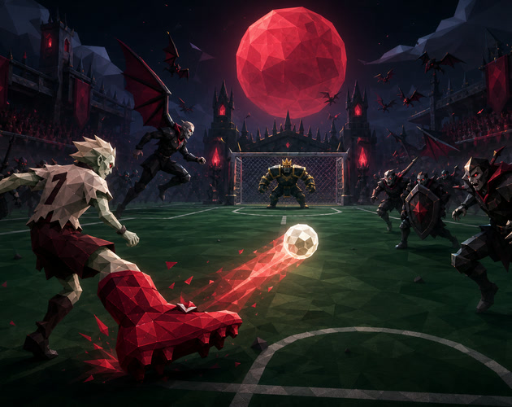

| Project   | Value                                        |
| --------- | -------------------------------------------- |
| Status    | Custom-player and original-audio milestone   |
| Theme     | Kickoff                                      |
| Team      | Huntrix — 2 participants                     |
| Platforms | Web, macOS, Windows, and Linux               |
| Stack     | Three.js, TypeScript, Vite, Rapier, Electron |
| Input     | Keyboard/mouse and standard gamepad          |

### Current title screen

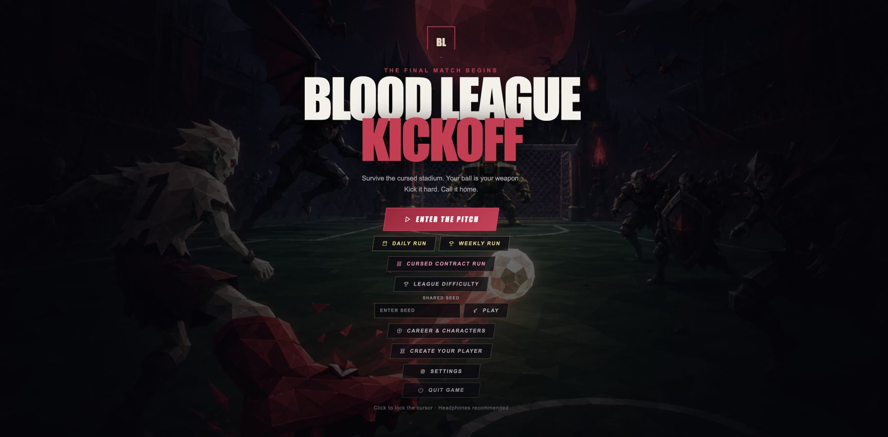

## The Game

The opening kickoff of a cursed football match awakens a stadium full of vampires. The last human striker must survive the match using an enchanted football, supernatural boots, and spectral teammates.

The ball is the player's main weapon, defensive tool, positional risk, and key to advancing the match. Kick, curve, rebound, recall, and volley it through the horde. Every goal begins another kickoff, mutates the enemy crowd, and pushes the player toward a final confrontation with Count Goalkeeper.

### Current gameplay

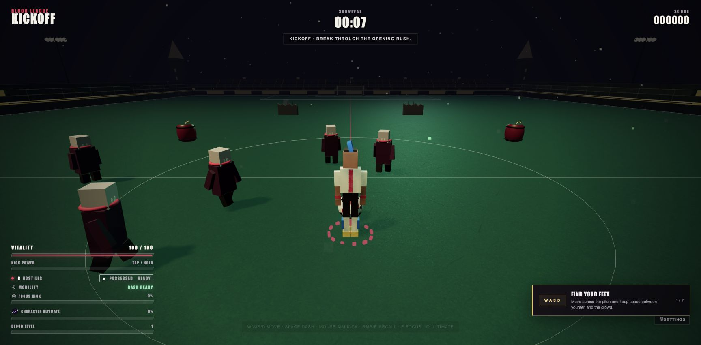

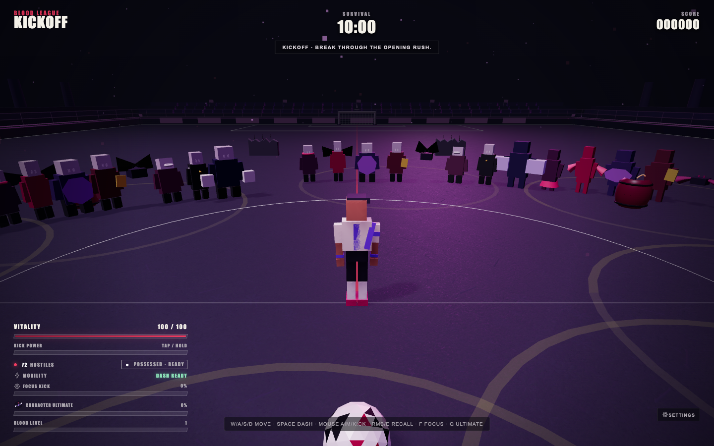

The playable pitch is now 136×88 world metres—roughly 68% more surface than the original field. Audited ambientCG CC0 color, normal, and roughness maps add genuine PBR turf detail beneath five live-switchable stadium palettes. Blood Court carries embers, Moonlit Classic uses drizzle, Emerald Cathedral glows with fireflies, Royal Amethyst throws arcane sparks, and Frostbound Arena snows. Crowds, rails, banners, flags, floodlights, and architecture-specific props react to match events. Select a stadium or random rotation from Settings.

The character overhaul now uses an original block-football visual language built entirely in TypeScript and Three.js. The player has a reusable articulated voxel skeleton with segmented arms and legs, readable face, layered kit, boots, sockets, and six distinct hero silhouettes. Ordinary enemies use matching block anatomy from near view through merged crowd LODs while retaining archetype-specific shields, wings, scarves, bows, gloves, and supernatural cues. No runtime character download is required. The football keeps its one-draw-call ivory, charcoal, and crimson panel treatment, while goals, nets, dugouts, floodlights, advertising boards, minibosses, and Count Goalkeeper retain their authored football-horror forms.

### Create your player

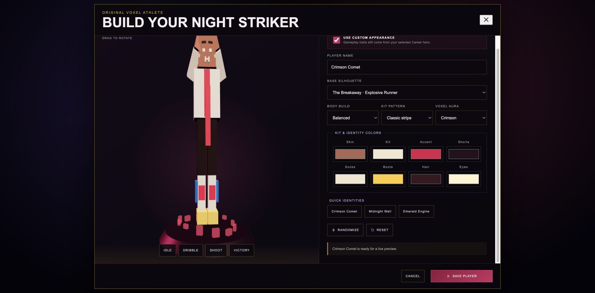

Create an original Night Striker without using a real-player likeness. Choose one of six animation-compatible silhouettes, agile/balanced/powerful proportions, four voxel kit patterns, an optional crimson/violet/gold aura, and separate skin, kit, accent, shorts, socks, boots, hair, and eye colors. The live WebGL preview supports idle, dribble, shot, and victory animations. The design is saved locally and follows the player into future matches, while the selected Career hero continues to control gameplay traits and balance.

### Original soundtrack and sound effects

Three original offline soundtrack files cover the title/menu, standard match, and Count Goalkeeper/final-wave states. The runtime crossfades between them through the existing adaptive mix and retains procedural layers and procedural fallbacks. Seven bundled Kenney UI Audio samples add confirmation, navigation, opening, closing, toggling, selection, and error feedback. Music and effects remain independently adjustable in Settings, and the release never contacts an AI or audio service at runtime.

### Cursed contracts and live telemetry

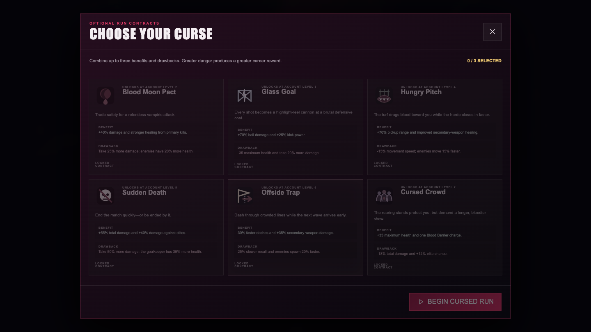

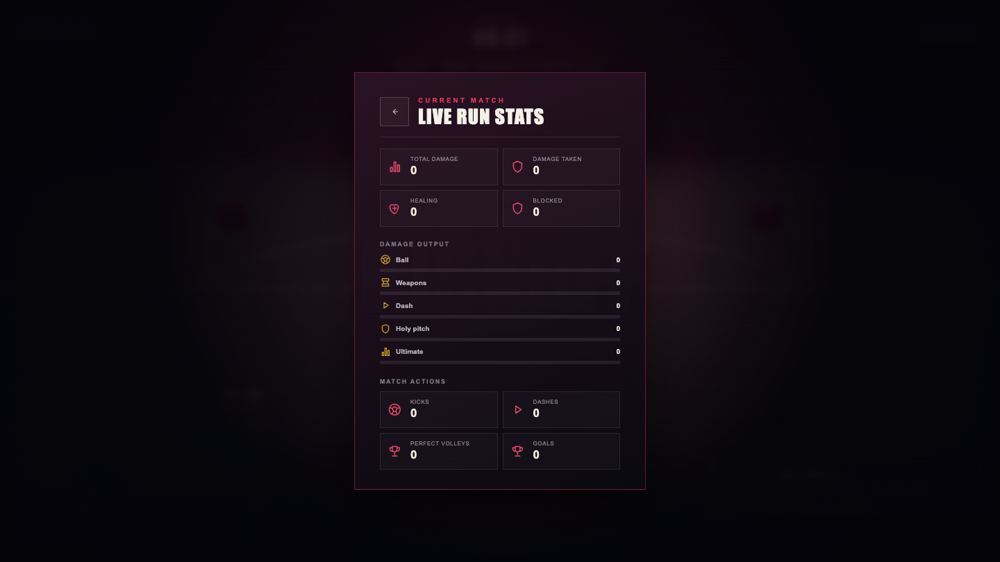

### Goalkeeper showdown

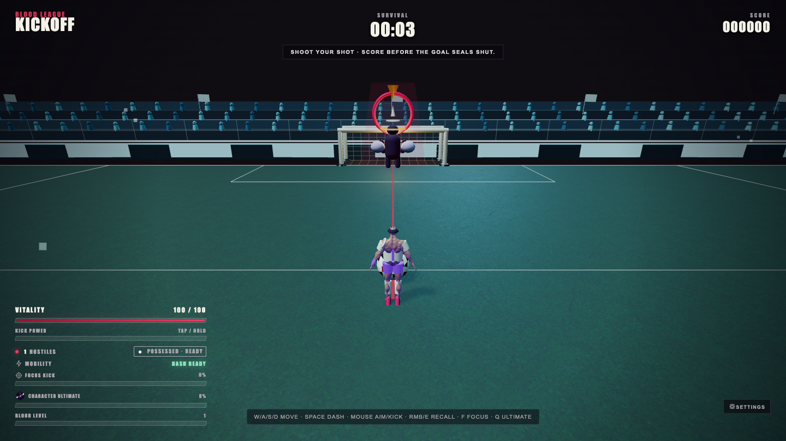

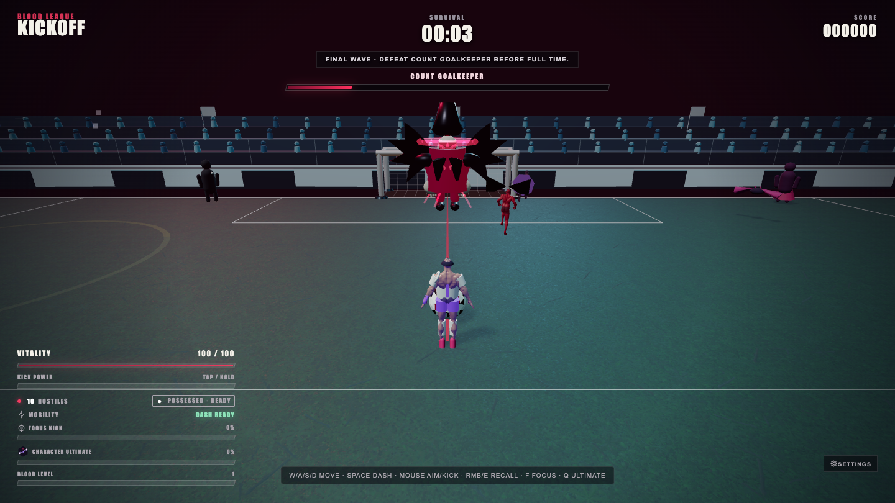

### Secondary weapon spectacle

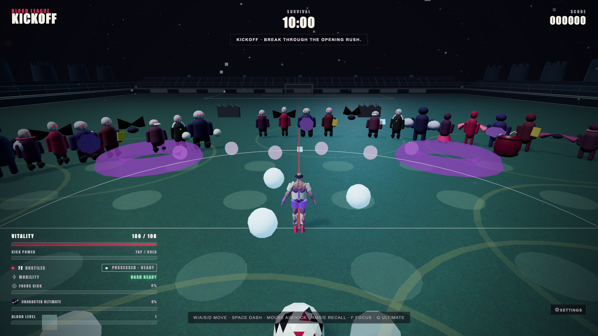

### Progression

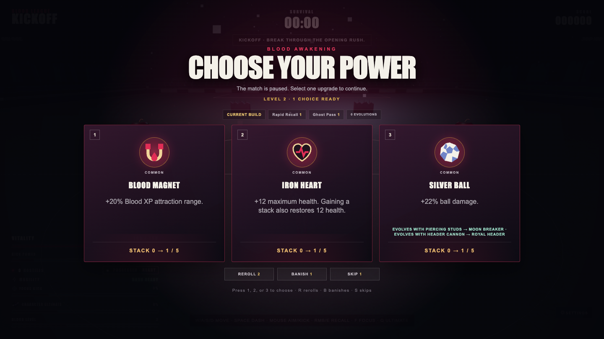

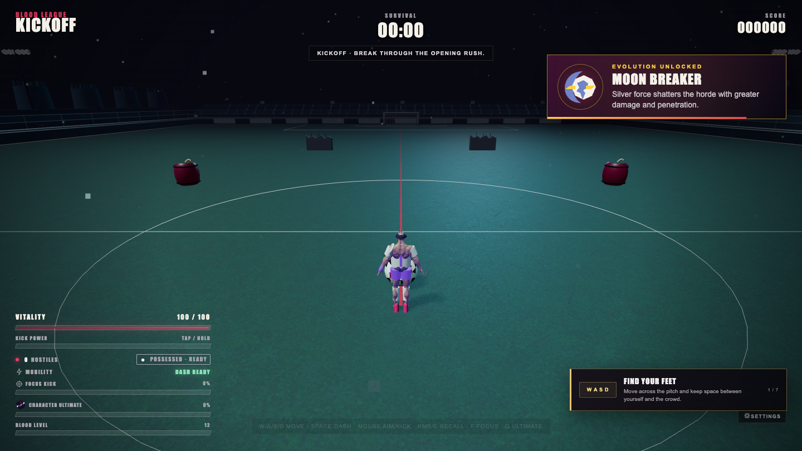

### Difficulty and Codex

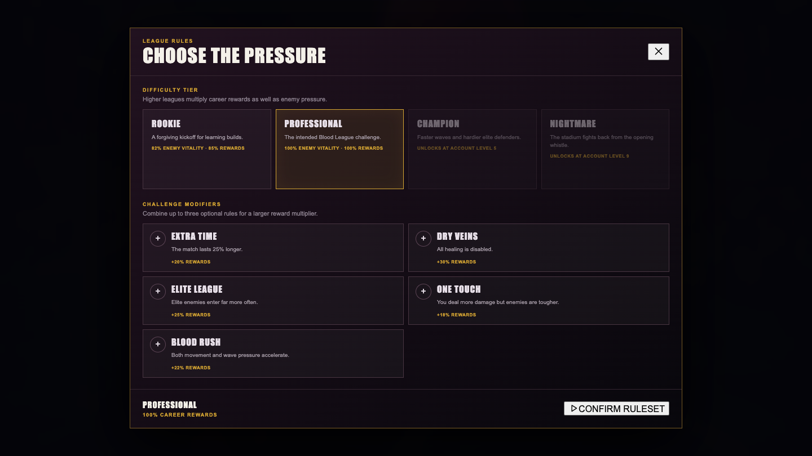

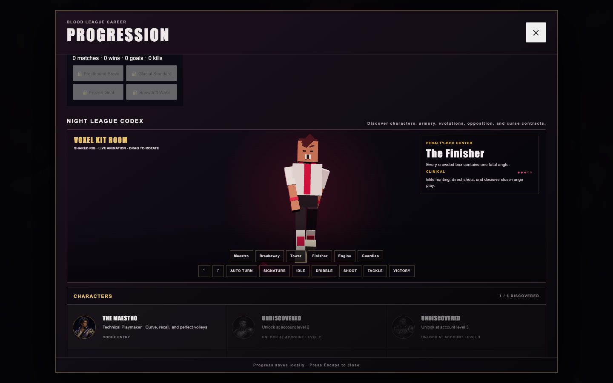

The kit room now resets every selected hero to a readable front-facing introduction, supports drag and button turntable controls, and exposes signature actions alongside concise trait, play-style, and difficulty guidance. Narrow layouts reposition the 3D stage so the identity card does not cover the character.

### Voxel armory and opposition

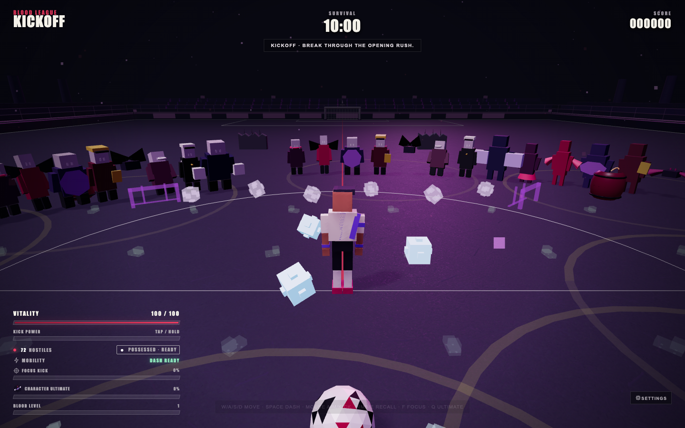

### Settings

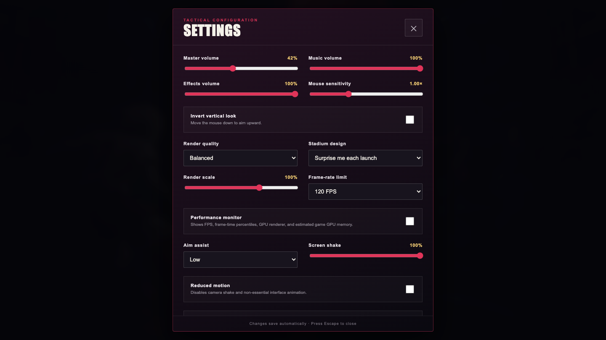

### Career

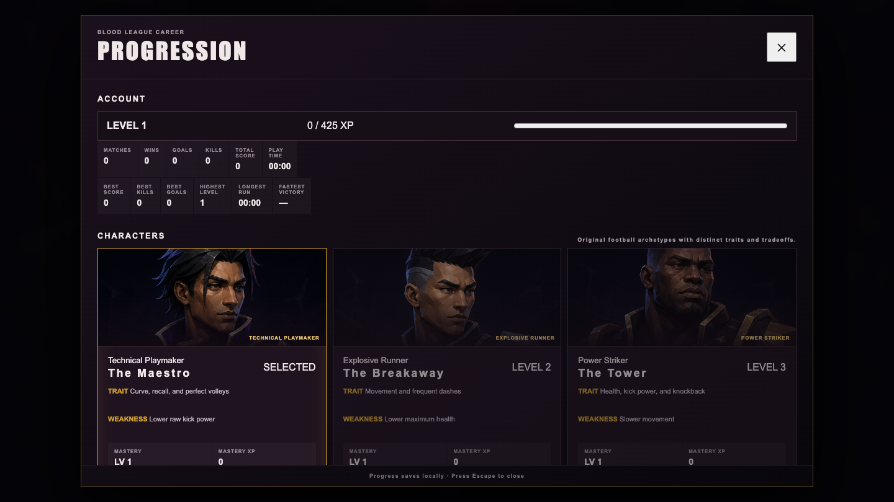

### Results

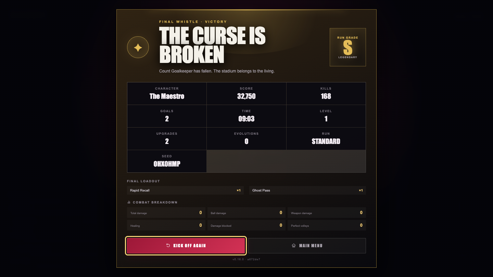

## Design Pillars

1. **The ball is the combat system.** Its movement and impact must feel excellent before more content is added.
2. **Every kickoff changes the match.** Goals advance phases, introduce enemy mutations, and transform the stadium.
3. **Readable spectacle.** Large crowds and strong impacts must remain easy to understand.
4. **Short, replayable runs.** A complete run targets 8–10 minutes.
5. **Performance is a feature.** The game targets stable 60 FPS and supports 120 Hz displays on capable hardware.

## Core Loop

1. Move through the stadium and control space.
2. Kick the ball through vampire crowds.
3. Recall, redirect, or perfectly volley the returning ball.
4. Use ground/lob passes, or dash through a forward slide tackle and turn a perfect volley into a bicycle-kick impact lane.
5. Collect blood shards and choose one of three upgrades.
6. Score when the enemy goal opens.
7. Survive the more dangerous kickoff phase.
8. Defeat Count Goalkeeper or fall and begin a new run.

## Characters and Long-Term Progression

The next replayability layer uses six original football-style archetypes. They do not use real-player names, faces, clubs, kits, celebrations, or other protected likenesses.

| Character     | Football identity       | Strength                            | Tradeoff                 |
| ------------- | ----------------------- | ----------------------------------- | ------------------------ |
| The Maestro   | Technical playmaker     | Curve, recall, and perfect volleys  | Lower raw kick power     |
| The Breakaway | Explosive runner        | Movement speed and frequent dashes  | Lower maximum health     |
| The Tower     | Powerful target striker | Health, kick force, and knockback   | Slower movement          |
| The Finisher  | Penalty-box hunter      | Direct damage against elite threats | Weaker secondary weapons |
| The Engine    | Relentless runner       | Pickup range and pitch coverage     | Lower starting damage    |
| The Guardian  | Defensive anchor        | Damage resistance                   | Lower kick power         |

Typed, immutable character definitions and modifier plumbing are implemented. The Career screen persists unlocks and selection, and each live run starts with the chosen character's gameplay traits. The shipping player is now a lightweight original voxel athlete generated locally at startup—there is no model fetch, skinning dependency, or loading fallback during kickoff.

All six selections share one articulated voxel skeleton while receiving animation-safe proportions, full football kits, unique block-built head and equipment silhouettes, boots, and palette accents: captain band and scarf, speed crest and calf fins, shoulder armor, fang collar, wrist wraps and canister, or keeper helm and forearm guards. Nineteen deterministic code-driven states cover idle, dribble, sprint, directional strafes, ground/lob passes, shooting, heading, slide tackle, bicycle kick, damage, knockdown, celebration, victory, defeat, and enemy chase/attack/hit motion. Transitions now blend instead of snapping, compatible techniques layer over continuing locomotion, upper-body aim remains independent from the legs, and render-only ground samples plant each foot against slopes. Six motion profiles give Maestro controlled elegance, Breakaway explosive cadence, Tower deliberate weight, Finisher aggression, Engine endurance, and Guardian stability. Brows, mouths, fangs, eye squint, reactions, celebrations, and deterministic blinking follow the active state.

The visual armory replaces plain combat primitives with cached compound voxel footballs, blood bolts, blood shards, cleated boots, spectral whistles, cursed goal frames, cards, trophies, and banners. Secondary-weapon families use authored per-model scale and orientation so they remain identifiable without becoming giant blocks. Ordinary opponents, both minibosses, and Count Goalkeeper now share the block-built anatomy language while preserving distinct equipment, posture, cadence, attack cues, and distance LODs. A saved custom-player appearance layers onto the same skeleton without changing simulation or animation semantics.

The Career Codex now includes an on-demand WebGL kit room using the shipping model and animations, plus 25 original generated portraits covering all six heroes, eleven ordinary enemies, four rival captains, two minibosses, the goal-line blocker, and Count Goalkeeper. Their generation briefs, preserved masters, crop history, and hashes are recorded in the [portrait generation record](docs/art/PORTRAIT_GENERATION_RECORD.md).

The previous Quaternius CC0 files remain preserved as audited reference assets but are no longer loaded by the player, Career preview, or ordinary-enemy renderer. Exact sources, bundled licenses, hashes, and optimization steps remain in the [asset credits](docs/ASSET_CREDITS.md). The [original hero visual bible](docs/HERO_VISUAL_BIBLE.md), [character asset pipeline](docs/CHARACTER_ASSET_PIPELINE.md), and [measured rig audit](docs/CHARACTER_RIG_AUDIT.md) document both the shipping voxel route and the optional future GLB route without using a real-player likeness.

Five passive upgrades now join twenty-one active weapon paths. Alongside health, pickup, damage, and life-steal passives, **Blood Barrier** blocks incoming hits and recharges during combat. The football armory adds Header Cannon, Corner Storm, Red Card, Spectral Teammate, Penalty Mine, and Boot Cyclone. Four new combinations—**Royal Header**, **Tempest Set Piece**, **Phantom Formation**, and **Referee's Reckoning**—expand the evolution roster to eleven. Six optional cursed contracts trade safety for stronger rewards and a more aggressive encounter director.

Every seeded run now draws one of four original rival clubs—Nightwing Athletic, Iron Coven FC, Velvet Fangs, or Graveyard United. Their identities alter bounded enemy health, speed, damage, and pressure. Timed Blood Multiball windows add up to four pooled spectral shots, while possession objectives reward sustained control with score and ultimate charge.

Each level-up is now a weighted Common/Rare/Epic/Legendary draft with two rerolls, one banish, and one skip per run. Cards expose owned stacks, evolution partners, and the build they advance. Account level unlocks additional weapons, curses, league tiers, and characters; the Career Codex records characters, weapons, evolutions, enemies, elite affixes, and curses.

Four league tiers—Rookie, Professional, Champion, and Nightmare—can be combined with up to three of five challenge modifiers. Enemy pressure and career rewards scale together, so higher difficulty changes both the match and its progression payoff.

A versioned local profile records account XP, six character unlock levels, 20-level character mastery with gameplay perks and rewards, eighteen achievements, lifetime statistics, personal bests, duplicate-safe run settlement, and the twenty most recent runs. Standard, daily, weekly, cursed-contract, and custom-seed runs preserve their seed and ruleset metadata. The Career screen exposes exact-build local score, fastest-victory, current-daily, and current-weekly tables. These rankings never claim to be global or cheat-proof.

Each stadium now has four mastery objectives—debut, victories, goals, and enemy defeats—for twenty cosmetic-only challenges. Rewards include profile titles, supporter banners, goal effects, and movement trails; they persist and can be equipped from the scroll-safe Career screen without adding permanent combat power.

## Controls

| Action                | Input                                                                                          | Status                                                    |
| --------------------- | ---------------------------------------------------------------------------------------------- | --------------------------------------------------------- |
| Move                  | `WASD`                                                                                         | Implemented                                               |
| Aim / camera          | Mouse                                                                                          | Conventional vertical look by default; inversion optional |
| Kick / charge / curve | Hold and release left mouse button; move mouse sideways while charging to bend                 | Implemented                                               |
| Ground pass           | Middle mouse button                                                                            | Implemented                                               |
| Lob pass              | `Shift` + middle mouse button                                                                  | Implemented                                               |
| Recall ball           | Right mouse button or `E`                                                                      | Implemented                                               |
| Restart after kickoff | `R`                                                                                            | Implemented                                               |
| Dash                  | `Space`                                                                                        | Implemented with cooldown and brief invulnerability       |
| Focus Kick ultimate   | `F`                                                                                            | Implemented with first-person slow-time aiming            |
| Character ultimate    | `Q`                                                                                            | Unique signature ability for each of six characters       |
| Pause                 | `Esc`                                                                                          | Implemented; also activates when the game loses focus     |
| Settings              | Title-screen or in-game `⚙ SETTINGS` button                                                    | Implemented and persistent                                |
| Gamepad               | Sticks move/aim, `RT` kick, `B` pass, right-stick click lob, `LT` recall, `A` dash, Menu pause | Implemented with sensitivity and vibration settings       |

Controls and bindings may change during playtesting.

## Team and Registration

**Huntrix** is registered for the IUT 12th ICT Fest 2026 GameJam under registration code **04-42417**.

| Participant         | Role   | Institution                                       |
| ------------------- | ------ | ------------------------------------------------- |
| Touhidul Alam Seyam | Leader | BGC Trust University Bangladesh                   |
| MD. Abtahee Kabir   | Member | Chittagong University of Engineering & Technology |

For participant privacy, contact details and student identity numbers are not published in this repository. The complete verified roster remains in the organizer registration. See [Submission identity](docs/SUBMISSION.md) for the public record used across release materials.

## Submission Scope

### Guaranteed build

- One playable striker and one gothic stadium
- One complete 8–10 minute run
- Kick, rebound, recall, curve, and perfect-volley mechanics
- Eleven normal enemy behaviors plus a multi-phase final boss
- Twelve upgrades and two evolved combinations
- Menus, settings, tutorial prompts, win, loss, pause, and restart
- Playable web build and native desktop packages for Windows, macOS, and Linux

### Target build

- Eight enemy behaviors with visual variants
- Twenty-one weapons, five passive upgrades, eleven evolutions, and six optional curses
- Six original football-style characters with starting loadouts and unique ultimates
- Persistent profile, 20-level mastery, challenges, seeded daily/weekly runs, history, and offline rankings
- Three match phases and a halftime choice
- Brief first-person Focus Kick ultimate
- Performance, balanced, and quality presets
- Expanded VFX, audio layers, accessibility, and presentation

Target features remain gated until the guaranteed vertical slice is fun, stable, and performant.

## Technology

- **Three.js / WebGL 2:** GPU-accelerated 3D rendering
- **TypeScript + Vite:** code-first development and browser builds
- **Rapier:** fixed-step WASM physics for the player, ball, arena, and important collisions
- **HTML/CSS:** menus, HUD, upgrade cards, and settings
- **Web Audio:** original offline soundtrack playback, adaptive crossfades, CC0 UI samples, layered procedural effects, football impacts, progression cues, and phase transitions
- **Electron:** self-contained GPU-accelerated desktop builds sharing the web gameplay code
- **electron-builder:** portable Windows, macOS, and Linux packaging
- **GitHub Actions:** native-runner web/desktop builds attached automatically to tagged releases

The game uses no AI service at runtime. Browser and desktop releases share the same gameplay code.

## Development

### Current progress — July 20, 2026

- [x] Game concept, theme interpretation, scope gates, and architecture selected
- [x] Git repository initialized from the jam's empty starting point
- [x] GitHub remote configured at `Seyamalam/blood-league-kickoff`
- [x] Documentation baseline committed
- [x] Three.js/Vite/Rapier source scaffold created
- [x] Fixed-step simulation with interpolated player, enemy, and ball rendering
- [x] Third-person movement, pointer-lock camera, kick, rebound, and manual/automatic recall
- [x] Charged kicks, a capped 36-unit ball speed, recall states, and perfect-return volleys
- [x] Eight enemy archetypes through Bat Swarm, Leech Striker, Corrupt Referee, and Goalkeeper Brute
- [x] Coach speed aura, durable Defender silhouette, and allocation-conscious crowd separation
- [x] Direct-reference enemy rendering with state-driven attack/defense poses and a five-mesh silhouette budget for every ordinary archetype
- [x] Replace smooth ordinary-enemy bodies with articulated voxel anatomy, eleven equipment identities, and merged block-built distance LODs
- [x] Enemy damage/death, scoring/combo, player damage/death, and restart
- [x] Procedural Web Audio for kicks, volleys, recalls, hits, kills, and player damage
- [x] Blood XP levels and a paused three-card upgrade choice flow
- [x] Four typed passive foundations—Iron Heart, Blood Magnet, Killer Instinct, and Blood Drinker—with bounded modifiers, weapon/passive offer balance, tests, and original icons
- [x] Apply every passive modifier and its health/life-steal feedback through the live runtime and upgrade UI
- [x] Six immutable original football-style character definitions with distinct strengths, weaknesses, affinities, modifier sets, and visual palettes
- [x] Add character selection/profile UI, live selected-character startup, and unlock presentation
- [x] Give every character a unique starting loadout, signature ultimate, HUD meter, icon, audio/VFX response, and rebindable control
- [x] Add a no-likeness hero visual bible, production turnaround prompt, exact shared-skeleton manifest, and reproducible GLB validator
- [x] Replace the runtime GLB player with an original articulated voxel rig, six block-built identities, and zero-load startup
- [x] Add a fifteen-state semantic football animation contract with explicit dedicated/alias/unavailable status
- [x] Drive semantic dribble/strafe/reaction/outcome animation states and add contact, recovery, and socket metadata
- [x] Add priority-safe code-driven voxel motion, deterministic completion recovery, and development-only joint inspection
- [x] Add deterministic pooled boot-contact, ground-impact, and goal-ring VFX with quality and reduced-flash scaling
- [x] Add grass footsteps, body impacts, goalkeeper-save layers, UI navigation cues, and strict procedural voice limits
- [x] Improve HUD ready-state feedback, menu icons/tooltips, keyboard focus, reduced motion, and short-viewport scrolling
- [x] Add original character portraits, six voxel-rig kit variants, and a live model/animation Codex preview
- [x] Silver Ball, Power Kick, and Rapid Recall immediately affect live combat
- [x] Pooled physical blood shards burst from kills, magnet to the player, and grant XP on collection
- [x] Piercing Studs, Garlic Trail, Orbiting Spectral Ball, Blood Bomb, and Ghost Pass work in live combat
- [x] Defender shields, rear-shot weakness, deliberate knockback, and telegraphed Winger lunges
- [x] Automated progression, pickup, secondary-weapon, match, and boss tests
- [x] Full nine-minute match director with two goals, halftime tactics, Blood Moon, boss wave, and victory screen
- [x] Phase-aware Spawn Director with authored population caps, spawn cadence, roster weights, and rest stages
- [x] On-pitch animated goal beacon during scoring opportunities
- [x] Expanded regulation-proportioned 88×136 pitch with shared field definitions, physical goal frames, deep nets, full markings, and scaled instanced crowds
- [x] Add five persisted/random stadium variants with distinct palettes, skies, fog, lighting, crowds, and gothic/bowl/cathedral/colosseum/fortress architecture
- [x] Add three reusable Momentum Gates with speed bursts, dash refunds, cooldown presentation, and ball-safe collision rules
- [x] Add a touchline-spanning Wide Overload Blood Moon formation and authored event-spacing protection
- [x] Replace the player placeholder with a detailed 36-part original humanoid, articulated animation, six character identities, resource budgets, and a documented GLB upgrade path
- [x] Retire runtime skinned-character loading after preserving the audited CC0 assets and validation route
- [x] Add stadium-specific weather, reactive crowds, pulsing rails, flags, banners, and floodlights
- [x] Add always-available slide tackles and charge-scaled bicycle-kick impact lanes
- [x] Add four seeded rival vampire clubs, Blood Multiball windows, and possession objectives
- [x] Add twenty stadium-mastery challenges with persistent cosmetic-only rewards and Career equip controls
- [x] Add architecture-specific reactive props that progressively fracture during match events
- [x] Integrate audited ambientCG CC0 PBR turf maps
- [x] Add ground/lob passes, enemy possession tackles, live goalkeeper shot prediction, and missed-dive punish windows
- [x] Formalize eleven enemy combat roles with stable threat/silhouette metadata and stronger miniboss identities
- [x] Add deterministic squad intelligence: support screening, opposite-side flanks, coach-led encirclement, and elite behavior-tree decisions
- [x] Add a deterministic 24-minute production-run plan and serializable eight-club tournament bracket foundation
- [x] Add bounded replay-highlight event recording for future match presentation
- [x] Add shake intensity, reduced-motion, and damage-number visibility settings
- [x] Swept whole-ball goal detection prevents tunneling and requires the complete ball to cross the goal line inside the physical frame
- [x] Special goalkeeper blocker protects the active scoring goal with dedicated state, elite presentation, and interception behavior
- [x] Speed-reactive ball trail, pooled hit/volley bursts, and restrained camera impact feedback
- [x] Persistent volume, sensitivity, conventional/inverted vertical look, quality, render scale, frame-rate, and reduced-shake settings
- [x] Count Goalkeeper final encounter with health phases, charges, contact attacks, boss HUD, and victory integration
- [x] Count Goalkeeper desperation phase transforms into a winged second form with an animated blood cape, halo, crown, and phase light
- [x] Rebuild Count Goalkeeper, both minibosses, barrels, beacons, barriers, and Momentum Gates with recognizable authored silhouettes and action poses
- [x] Escalation and Blood Moon stadium transformations add an animated moon/corona, pitch runes, pylons, and phase lighting with owned-resource cleanup
- [x] Six character archetypes have distinct procedural silhouette accessories and locomotion animation without external runtime assets
- [x] Every secondary weapon and evolution can damage Count Goalkeeper through capped boss-only routing without granting ordinary kill rewards
- [x] Five automatic evolutions: Moon Breaker, Crimson Meteor, Grave-Frost Wake, Storm Halo, and Phantom Singularity
- [x] Add six football-armory weapons and four football-themed evolutions with bounded pools and authored icons
- [x] Add six optional risk/reward curses and a scroll-safe cursed-contract run setup
- [x] Cross-weapon evolution mechanics add freezing garlic trails, chain-lightning orbiters, and ghost-triggered singularities
- [x] Upgrade cards show evolution partners, unlock toasts use unique icons, and results preserve the evolved final loadout
- [x] Full match director covers first goal, escalation, halftime, Blood Moon, final goal, boss wave, and outcomes
- [x] Power, Pace, and Control halftime choices apply distinct second-half combat bonuses
- [x] Goal celebrations reset the live formation and begin a fresh kickoff without erasing run progress
- [x] Stage-reactive fog, lighting, embers, and animated match announcements communicate escalation
- [x] Cinematic letterbox/vignette presentation strengthens boss reveals, evolutions, Blood Moon, victory, and defeat beats
- [x] Count Goalkeeper summons readable boosted Winger and Defender elites
- [x] Accessible pause menu and detailed victory/defeat results with run statistics and final loadout
- [x] Add a live in-run telemetry screen with damage-source shares, healing, blocks, kicks, dashes, volleys, and goals
- [x] Add custom-seed runs, goal-quality rewards, and eighteen persistent achievements
- [x] Add weighted Common/Rare/Epic/Legendary upgrade drafts with two rerolls, one banish, one skip, owned-stack context, and evolution previews
- [x] Add account-level weapon/curse unlocks, mastery-level-five bonuses, and a full Career Codex
- [x] Add Rookie, Professional, Champion, and Nightmare leagues plus five stackable challenge modifiers and reward scaling
- [x] Add long-shot, volley, rebound, setup-touch, placement, and goal-streak scoring feedback
- [x] Add deterministic nine-minute simulations for every character, representative builds, curses, elites, minibosses, and Count phases
- [x] Focus-loss and hidden-window pause protection
- [x] Seven-step first-run tutorial for movement, kick, recall, dash, character ultimate, progression, and scoring
- [x] Restrained mouse-intent kick curve with speed-cap and recall safeguards
- [x] Stadium-boundary camera collision prevents orbit clipping through outer walls
- [x] Live diagnostics report FPS/frame time, draw calls, triangles, fixed steps, enemies, and pooled-object use
- [x] Add a development-only browser diagnostics bridge with frame percentiles, 60/120 FPS misses, GPU limits, and resource counts
- [x] Add a persistent top-right performance monitor with FPS, frame time, p95/p99, detected GPU, and estimated game GPU memory
- [x] Five fixed secondary-weapon `InstancedMesh` batches replace 45 individual render meshes
- [x] Full-pool diagnostics track all 45 visible secondary objects and prove a five-draw-call ceiling
- [x] Typed-array spatial grid replaces full-crowd separation and Coach-aura scans
- [x] Procedural match music blends drone, tension, pulse, choir, and percussion-style layers across every phase
- [x] Expanded procedural cue vocabulary covers football-frame impacts, goalkeeper actions, dash/healing, progression, match transitions, and UI feedback with retrigger protection
- [ ] Connect every expanded audio cue to its authoritative runtime/UI event and complete the final mix
- [x] Automated wall, corner, stall, out-of-bounds, recall, catch, reset, and curved-flight recovery coverage
- [x] Planar stall detection and immediate catch-velocity cleanup close two ball recovery edge cases
- [x] Independent persistent master, music, and effects volume controls with safe schema migration
- [x] Long red world-space aim line replaces the screen crosshair while Off/Low/High aim assist gently steers nearby intended targets
- [x] Distinct procedural boss entrance, phase escalation, victory, and defeat cues
- [x] Dedicated procedural evolution cue and version/commit metadata on run results
- [x] First-person Focus Kick ultimate with combat-built meter, slow-time aim, empowered shot, and cooldown
- [x] Storm Studs chain lightning with deterministic bounded hops and cyan impact feedback
- [x] Frost Cleats impact bursts with deterministic victim caps, damage, and timed movement slow
- [x] Spectral Volley multiball with a bounded six-shot pool and deterministic impact fan
- [x] Void Goal black holes with a four-zone pool, capped pulses, damage, and inward pull
- [x] Color-independent ball-state patterns and animated geometric special-attack markers
- [x] Rebindable persistent keyboard controls with safe validation and conflict prevention
- [x] Outcome-specific results presentation with deterministic accessible S–D run grades
- [x] Versioned local profile foundation for account XP, character unlocks/mastery, ten challenges, lifetime statistics, personal bests, duplicate-safe settlement, and bounded run history
- [x] Local/offline score and fastest-victory leaderboard repository partitioned by exact build version and optional character
- [x] Integrate profile settlement, progression/history screens, personal-best feedback, character selection, and clearly labeled local leaderboards into the runtime UI
- [x] Add deterministic run-wide seeds for standard, daily, weekly, cursed, and custom-seed play; no online leaderboard is currently claimed
- [x] Complete HMR/shutdown disposal for listeners, UI, WebGL, shared render resources, and Rapier
- [x] Secure macOS Electron window-size and fullscreen/windowed controls, with desktop Quit available only from the title screen
- [x] Deterministic full nine-minute stage/deadline/goal/halftime/boss outcome coverage, secondary-boss damage parity, and dense-crowd stress tests
- [x] Development-only deterministic 72-enemy profiling scene with a read-only automation snapshot
- [x] ESLint, Prettier, pinned Node/npm metadata, clean `npm ci`, and push/PR verification workflow
- [x] Current title, gameplay, goalkeeper, upgrade, evolution, settings, pause, and results screenshots stored in the repository
- [x] Ball stall/timeout/out-of-bounds recovery fail-safes
- [x] Playable HUD with kickoff/death overlays, health, time, score, enemy count, ball state, and FPS
- [x] Electron shell created and booted on macOS
- [x] Tag-triggered verified web/macOS prerelease workflow added; Windows/Linux packaging remains explicit manual final-only work
- [x] `v0.8.0-alpha.4` published with nine CI-built artifacts and a verified combined SHA-256 manifest
- [ ] Download and smoke-test the exact published `v0.9.0-rc.1` web/macOS artifacts
- [x] Type-check and production web build pass locally
- [x] Browser visual smoke tests pass kickoff, live HUD, spawning, death, and restart flows
- [x] Production Electron shell boots locally on macOS
- [ ] Pointer-lock combat feel accepted through a manual playtest
- [ ] Human balance testing for the complete nine-minute configuration
- [ ] Test the downloaded Windows and Linux packages on their target operating systems

### Project documents

- [Production plan](Plan.md)
- [Ordered task list](TODO.md)
- [Game design](docs/GAME_DESIGN.md)
- [Technical architecture](docs/TECHNICAL_ARCHITECTURE.md)
- [Locked visual direction](docs/VISUAL_DIRECTION.md)
- [Release process](docs/RELEASE_PROCESS.md)
- [Asset credits](docs/ASSET_CREDITS.md)
- [Submission asset inventory](docs/ASSET_INVENTORY.md)
- [Release-candidate QA record](docs/RELEASE_CANDIDATE_QA.md)
- [Character GLB asset pipeline](docs/CHARACTER_ASSET_PIPELINE.md)
- [Original hero visual bible](docs/HERO_VISUAL_BIBLE.md)
- [Hero turnaround generation prompt](docs/HERO_CONCEPT_PROMPT.md)
- [Measured character rig audit](docs/CHARACTER_RIG_AUDIT.md)
- [Post-RC expansion roadmap](docs/EXPANSION_ROADMAP.md)
- [Performance baseline](docs/PERFORMANCE_BASELINE.md)
- [Changelog](CHANGELOG.md)

### Local development

Active development uses the browser and Electron workflows:

```bash
npm install
npm run dev
npm run build
npm run typecheck
npm run lint
npm run format:check
npm run check
npm run assets:gltf:validate
npm run assets:gltf:inspect
npm run assets:gltf:optimize -- path/to/model.glb
npm run deploy:itch:web
npm run desktop
npm run desktop:dev
npm run package:mac
```

Open `/?rigDebug=1` in a development build to inspect the live articulated voxel joints. Open
`/?diagnostics=1` and call `window.__bloodLeagueDiagnostics()` from the browser console for a frozen performance
snapshot. Both routes are disabled in production builds. The optional GLB optimization route writes a candidate under the ignored
`artifacts/asset-candidates/` directory and never replaces a canonical runtime asset.

The web build is emitted to `dist/`. Copy `.env.example` to ignored `.env.local`, set `BUTLER_API_KEY`, and run `npm run deploy:itch:web` for a verified local upload. Pushes to `main` run the same full check and automatically update the `seyamalam/blood-league-kickoff:html5` itch.io channel through the encrypted GitHub secret. Manual dispatches are also restricted to `main`; pull requests never deploy. On itch.io, the project is configured as HTML and only the Butler-managed `html5` upload is marked playable in the browser.

Version tags run the verified web/macOS release workflow and attach those artifacts plus `SHA256SUMS.txt` to the matching GitHub Release. Hyphenated development tags publish as prereleases; plain semantic-version tags publish to GitHub's stable Latest Release channel. Windows and Linux remain explicit, confirmation-gated native builds. Automated macOS builds are currently unsigned and unnotarized; see the [release process](docs/RELEASE_PROCESS.md) for first-launch guidance.

## Versioning and Releases

Development history is part of the jam submission, so changes are committed in small, reviewable units and pushed frequently. Each major playable milestone receives:

1. Updated README progress and game documentation
2. A verified production build
3. A milestone commit pushed to GitHub
4. A version tag and GitHub release with verified web/macOS artifacts; confirmation-gated native platforms are added after explicit validation

Planned release line:

| Version           | Milestone                                                                      |
| ----------------- | ------------------------------------------------------------------------------ |
| `v0.1.0`          | Foundation scaffold                                                            |
| `v0.2.0`          | Player–ball combat prototype                                                   |
| `v0.3.0`          | Three-minute vertical slice                                                    |
| `v0.5.0`          | Complete guaranteed run                                                        |
| `v0.6.0`          | First-run onboarding, curved kicks, and live diagnostics                       |
| `v0.7.0`          | Crowd scaling, recovery hardening, and phase music                             |
| `v0.7.1`          | macOS controls, audio mixing, and CI hardening                                 |
| `v0.8.0-alpha.1`  | Target gameplay/content checkpoint                                             |
| `v0.8.0-alpha.2`  | Presentation, progression UI, and macOS QA checkpoint                          |
| `v0.8.0-alpha.3`  | Cross-platform packaging, pacing, and release hardening                        |
| `v0.8.0-alpha.4`  | Native release-pipeline correction                                             |
| `v0.8.0-alpha.5`  | Regulation field, scoring, goalkeeper, and aiming pass                         |
| `v0.8.0-alpha.8`  | Content, encounters, characters, and UI expansion                              |
| `v0.8.0`          | Content and presentation complete                                              |
| `v0.9.0-rc.1`     | Feature-complete release candidate                                             |
| `v0.10.0-alpha.1` | Larger fields, stadium variety, and humanoid presentation                      |
| `v0.11.0-alpha.1` | Animated striker, rival clubs, living arenas, and mastery                      |
| `v0.12.0-alpha.1` | Football systems, tournament foundation, and match polish                      |
| `v0.13.0-alpha.1` | Shared-rig variants and original-hero production foundation                    |
| `v0.13.0-alpha.2` | Verified all-platform release checkpoint                                       |
| `v0.13.0`         | Stable all-platform character-visuals milestone                                |
| `v0.13.1`         | Live chase-camera and synchronized aiming repair                               |
| `v0.14.0`         | Animation, VFX, audio, UI, and performance telemetry                           |
| `v0.15.0`         | Authored enemies, encounters, football, and stadium visuals                    |
| `v0.16.0`         | Character kits, complete motion set, reactive VFX, and original portrait Codex |
| `v1.0.0`          | Jam submission freeze                                                          |

Releases are snapshots, not permission to skip validation. The final source and itch.io artifacts must correspond to the frozen submission revision.

## Jam Requirements

- Development must begin from an empty Git repository and the repository must remain public for verification.
- The submission must include a working Windows or web build requiring no additional software; we plan to provide both.
- Project files and repository commits must freeze after **July 20, 2026 at 11:59 PM (Asia/Dhaka)**. Post-deadline changes before the onsite event may disqualify the team.
- The pitch video is due **July 21, 2026 at 11:59 PM (Asia/Dhaka)**.
- The onsite round is **July 25, 2026** for the selected top 15 teams.
- All reused assets must be licensed and credited.

Refer to [RuleBook for GameJam_IUT_12th_ICT_Fest.md](RuleBook%20for%20GameJam_IUT_12th_ICT_Fest.md) for the complete rules.

## Credits

Created by **Huntrix**: Touhidul Alam Seyam and MD. Abtahee Kabir. Project-created and generated assets, tools, third-party dependencies, and licenses are recorded in the [asset credits](docs/ASSET_CREDITS.md).
